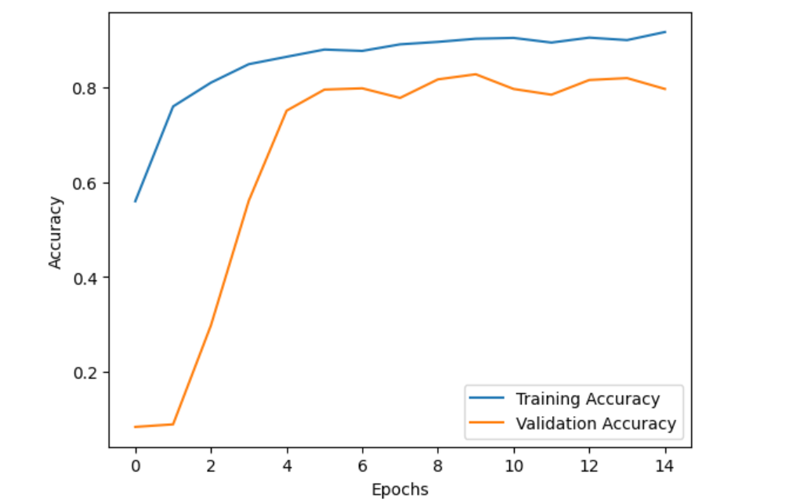
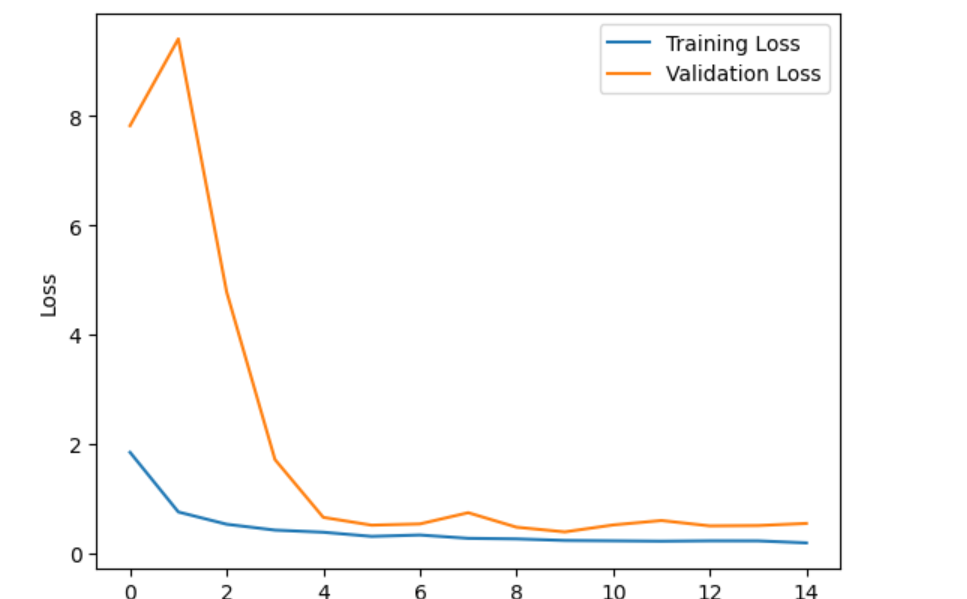
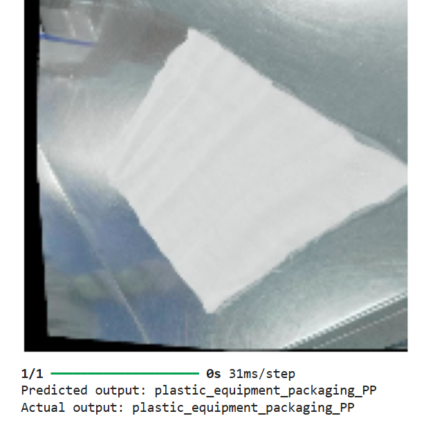

# clinical-waste-detection

### Tools Used:
- **TensorFlow** – Used for building and training machine learning models to classify clinical waste.
- **OpenCV** – Used for image processing, capturing, and manipulating clinical waste images.
- **NumPy** – Used for numerical operations and handling arrays in the image processing pipeline.

### Description:
This project aims to detect clinical waste through image classification. The model is trained to identify different types of clinical waste such as syringes, needles, and medical gloves from images. The project utilizes deep learning models built with TensorFlow, along with image preprocessing techniques from OpenCV to ensure accurate detection.

### How to Run:
1. Clone the repository:
   ```bash
   git clone https://github.com/rea-git/clinical-waste-detection.git



